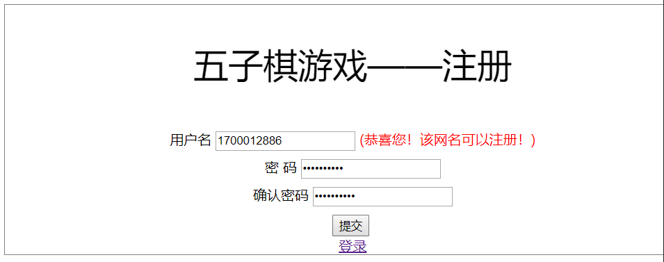
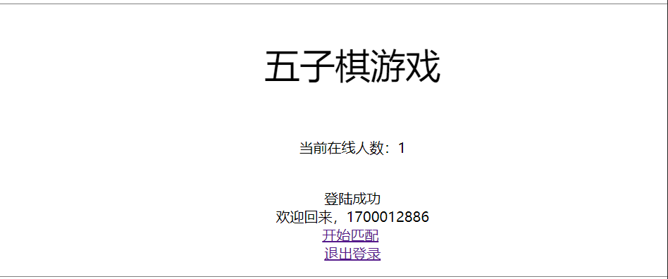
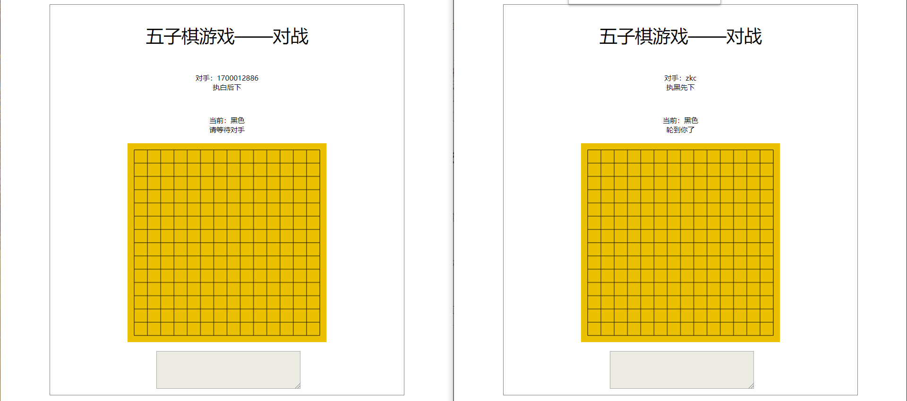
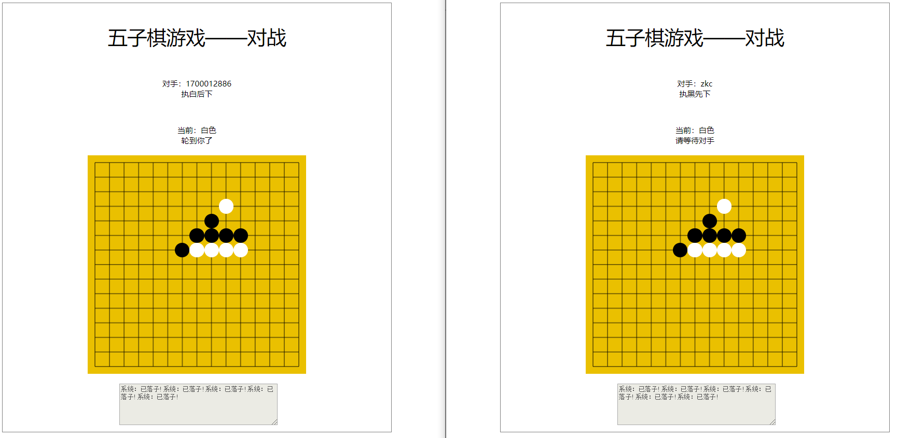
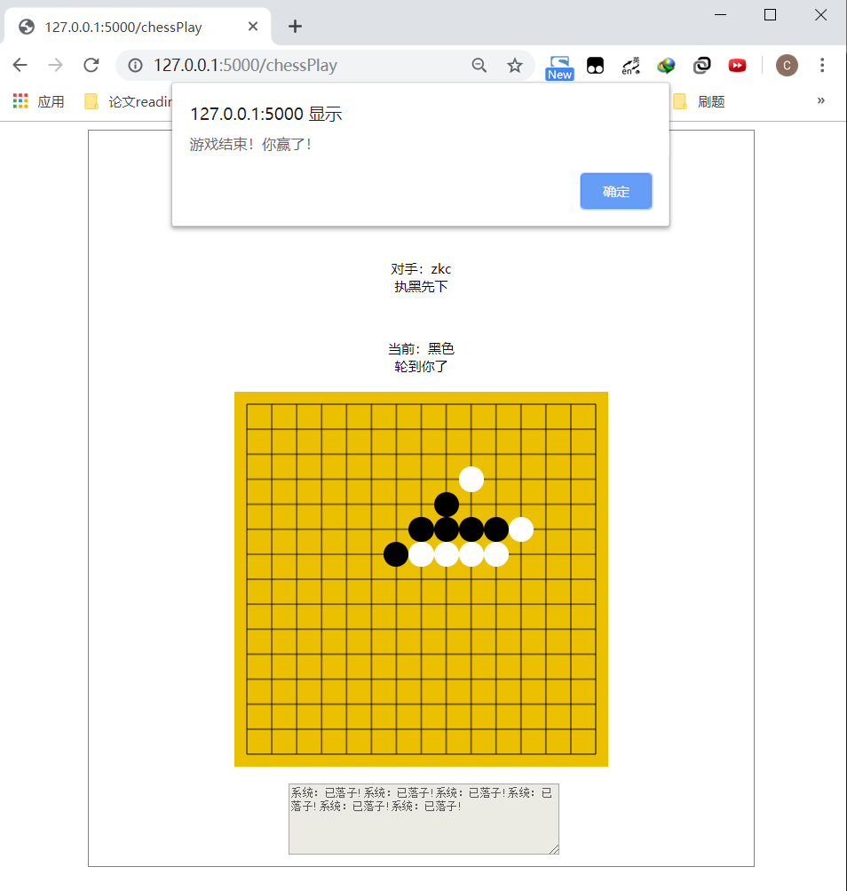

### Work06——五子棋对战平台

> 1700012886 张克驰

#### 启动

- 运行`python main.py`

#### 注册登录模块

- 使用数据库sqllite进行用户数据的存储，数据库文件位于`data`目录下
- 使用了基本的ajax来提升用户体验，如对用户名进行实时检测等
- 
- 

#### 匹配模块

- 使用等待队列的方式，在发现多名玩家的时候进行随机匹配
- 同时使用ajax的方式，实时获取当前在线人数
- 
- 

#### 对战

- 使用canvas绘制棋盘，具有一定的美观度
- 使用click进行触屏交互，提升用户体验
- 对战中进行适度的提示，如当前回合颜色等等
- 

- 
- 

- 对战结束后返回匹配界面
- 